# FriendsBridge_master

해커톤 참가 당시 팀원들과 제작한 코틀린 기반 메모 공유 어플 FriendsBridge 입니다.  
팀원이 기존 private 레포지토리를 삭제하여, 부득이하게 저장해둔 zip 파일을 새로 public 레포지토리로 개설한 점 참고 부탁드립니다.  
하단 리드미와 구글 드라이브 링크의 시연 영상과 발표자료 pdf 참작 부탁드립니다. (드라이브 자료는 리드미와 동일합니다.)  
https://drive.google.com/drive/folders/1sp6DmWyv4PMj63gCP1X__MamCfw6TG8k?usp=sharing  
감사합니다. 

## 소개 자료  
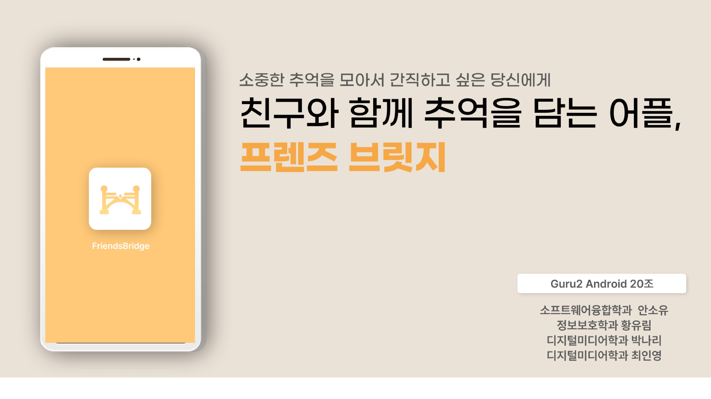  
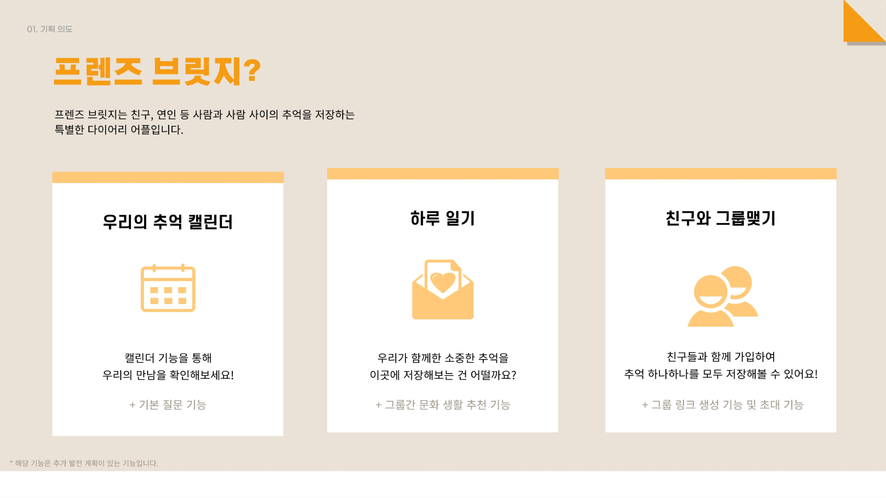  
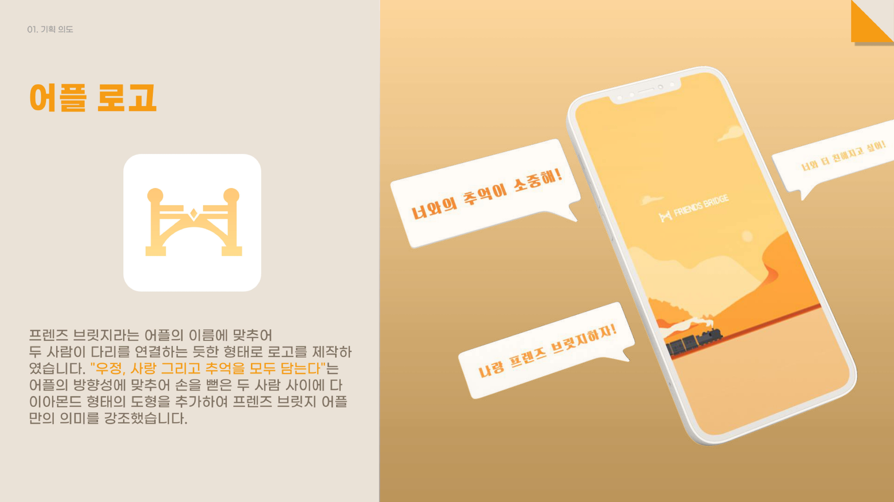  
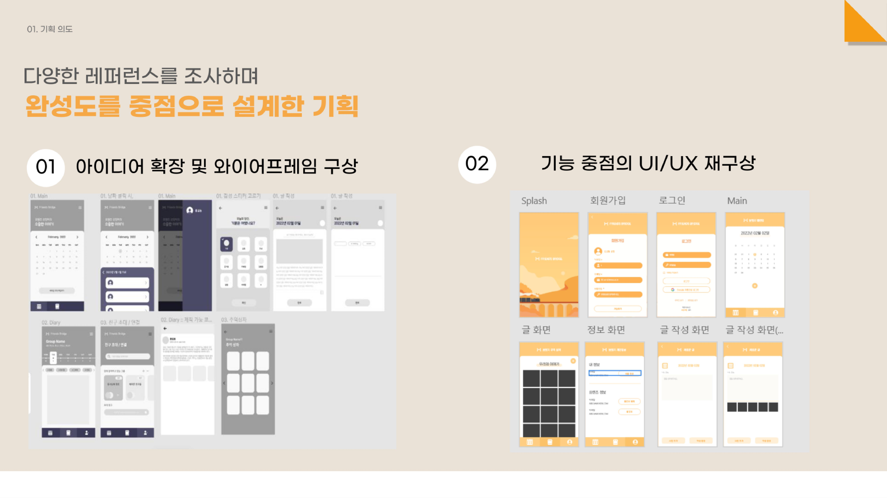  
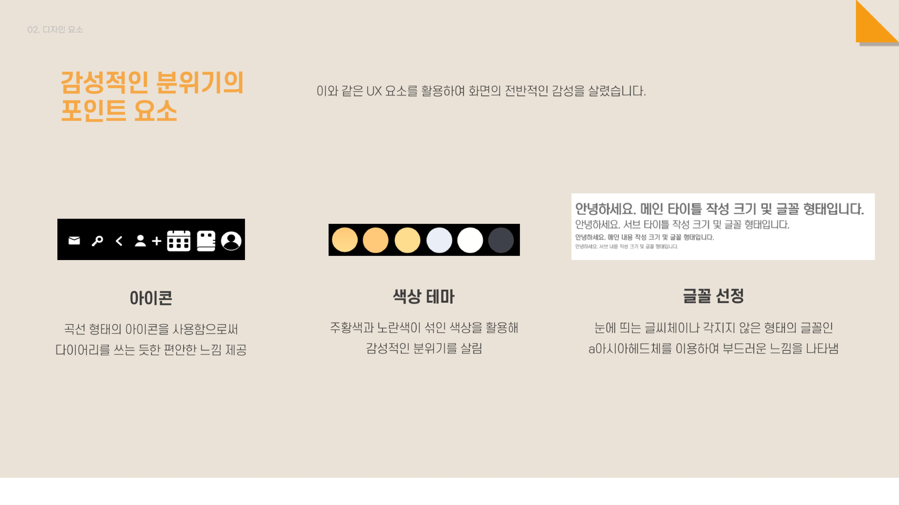  
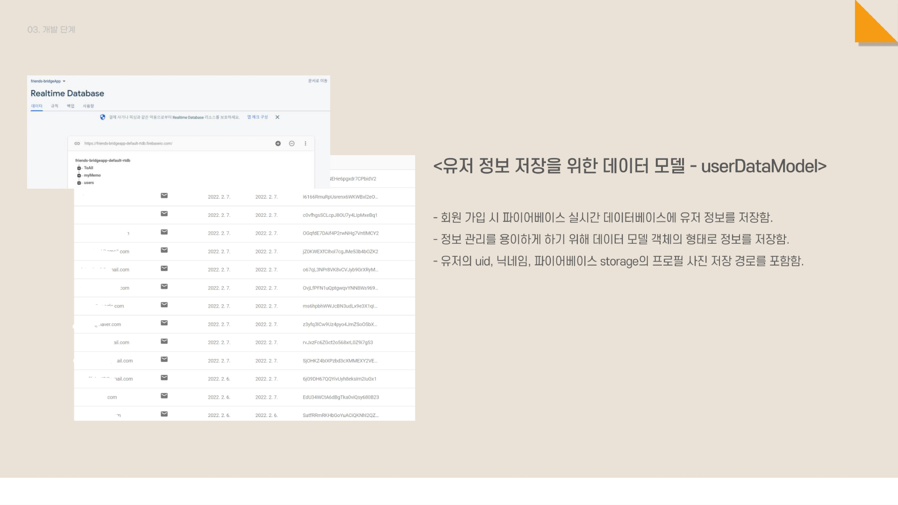  
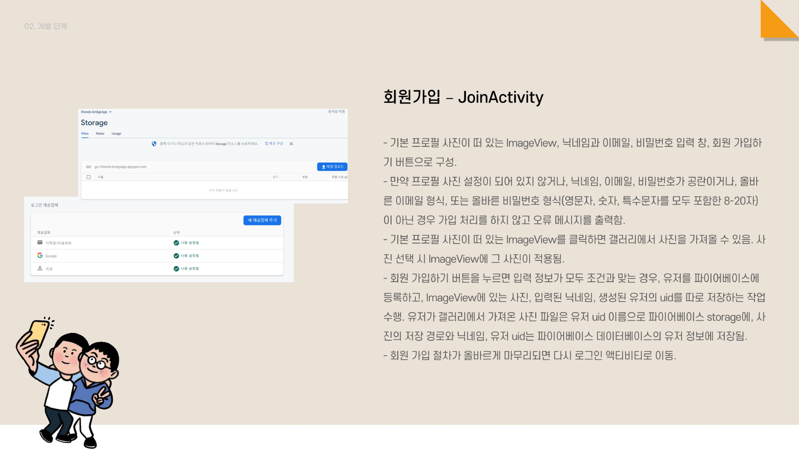  
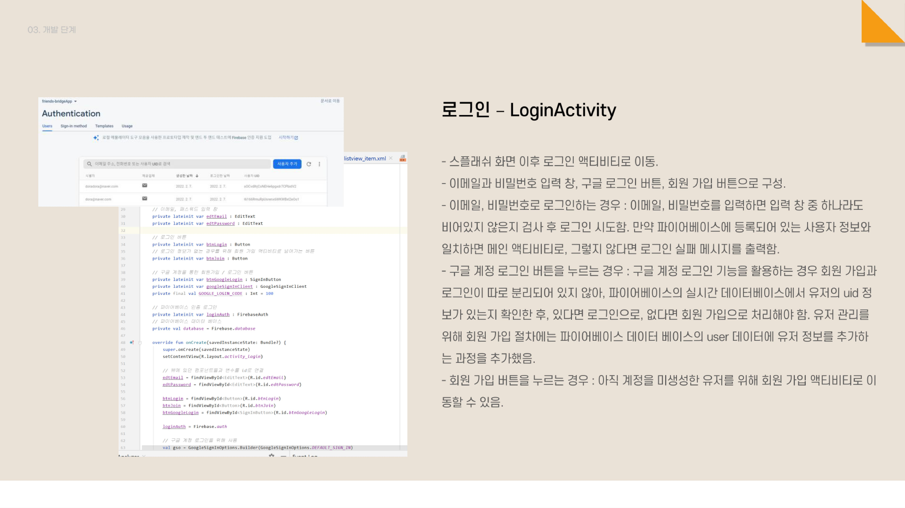  
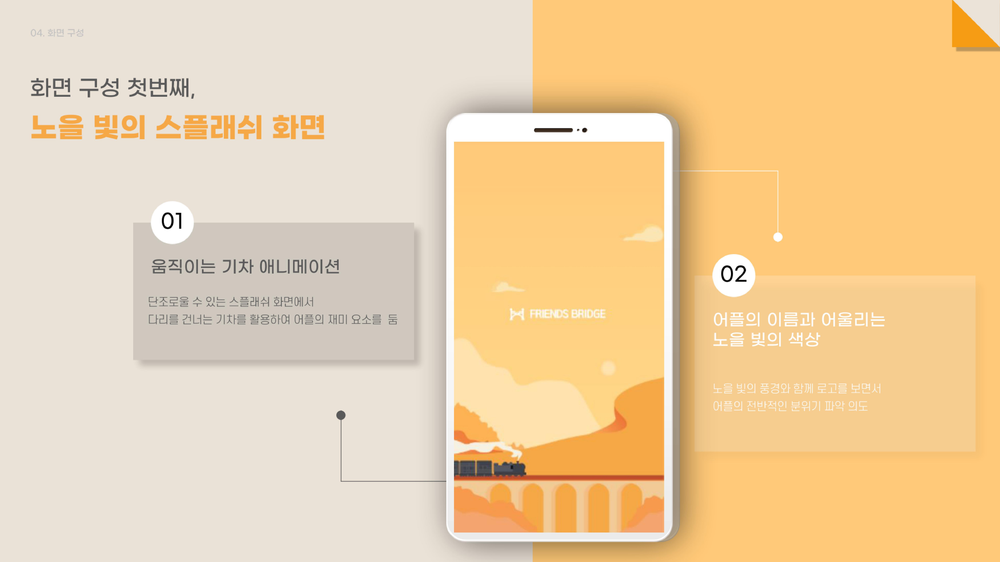  
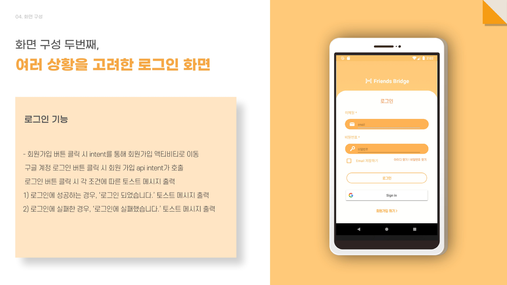  
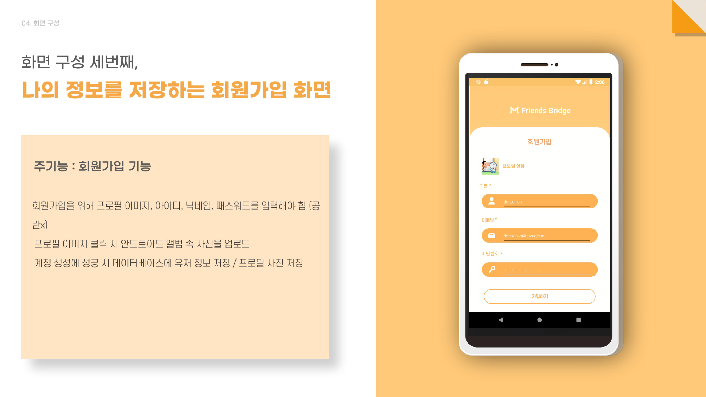  
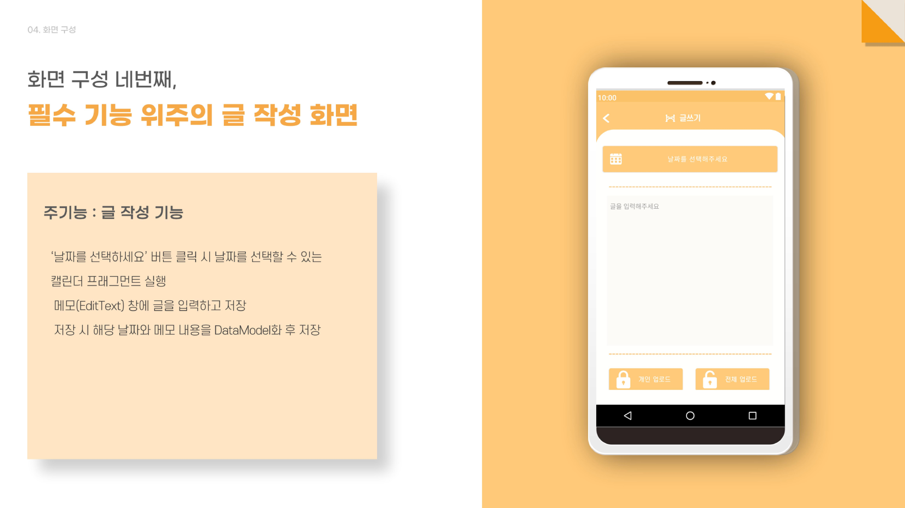  
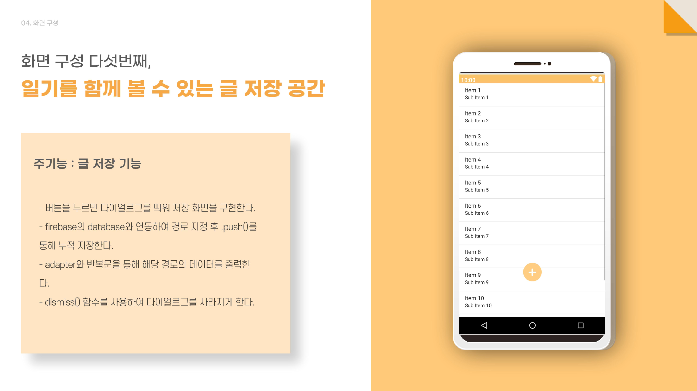  
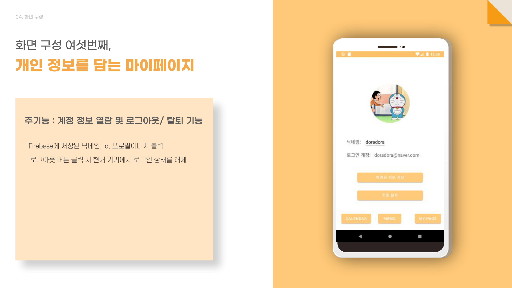  
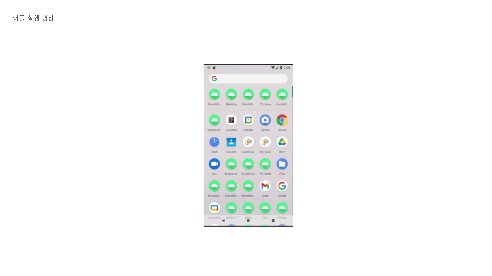  
---
## 시연 영상  

 

